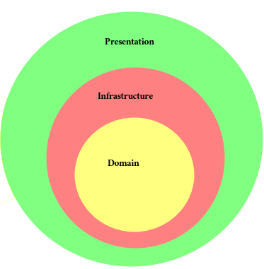

# Base de Questão API

Projeto faz parte do MVP 1 do curso de pós-graduação em Engenharia de Software da PUC-RIO.

A Base de Questão API provê questões de concursos, vestibulares, certificação e dentre outras. Aplicações poderão 
utilizar esse serviço construir simulados, exercícios e avaliações, ganhando agilidade no processo de criação e evitando
o cadastro manual de questões visto que a base de questões disponibilizará um conjunto de questões.

---
## Arquitetura da API

A aplicação foi construída base na arquitetura de clean architecture, composto pelas camadas:

- **Domínio** - onde está concentrada a lógica de negócio, essa camada não possui dependência de frameworks.
- **Infraestrutura** - onde estão as tecnologias utilizadas como, por exemplo, banco de dados, log...  
- **Apresentação** - camada que interage com os meios externos, sem conter nenhuma regra de negócio.



Estrutura de Pacotes:

- Domain
  - Models
    - DTO
    - Enum
    - Repositories
  - User Cases
- Infrastructure
  - DB
    - Connection
    - Entities
    - Repositories (Implementation)
  - Memory
    - Repositories (Implementation)
- Presentation
  - Rest API
  - Schemas


---
## Tecnologias utilizadas

- Python
- Flask
- OpenAPI
- Pydantic
- SQLAlchemy
- SQLite3

## Como executar

1. Baixe ou clone este repositório usando git clone https://github.com/dirceus/pos-grad-mvp1-backend.git;

2. Crie um ambiente virtual do tipo [virtualenv](https://virtualenv.pypa.io/en/latest/installation.html).

3. No ambiente virtual, instale as dependências através do comando:
```
(env)$ pip install -r requirements.txt
```
4. Execute a API através do comando
```
(env)$ flask run --host 0.0.0.0 --port 5000
```
5. Com a aplicação rodando, abra no navegador a url: [http://localhost:5000/#/](http://localhost:5000/#/)
